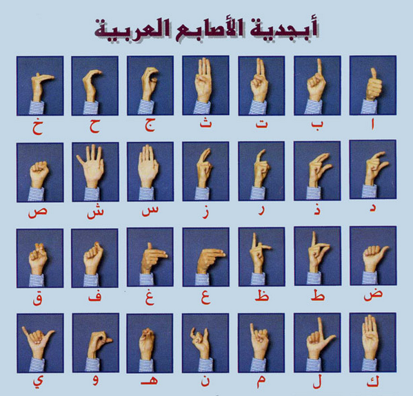
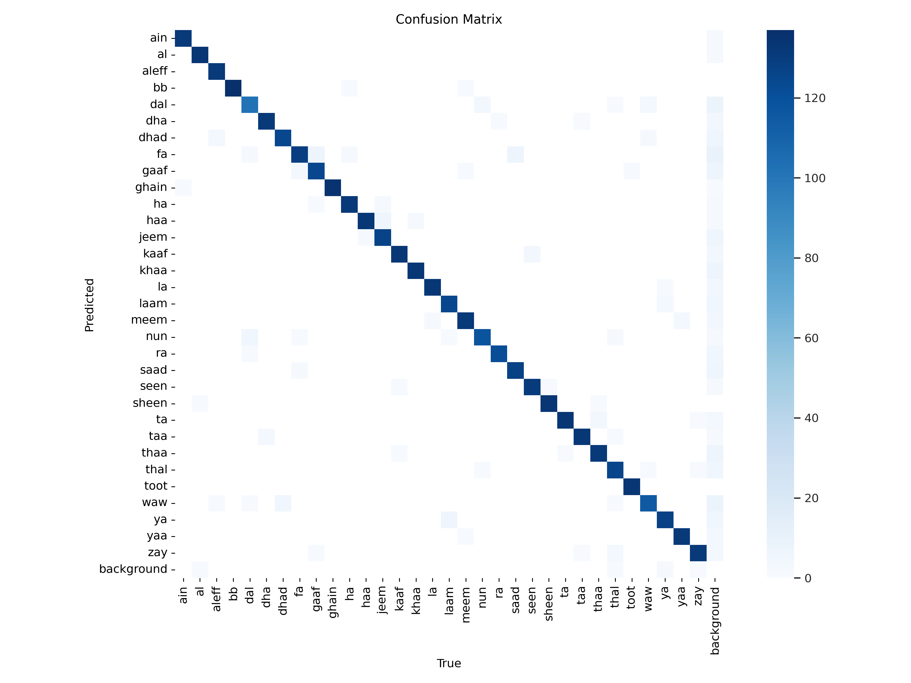
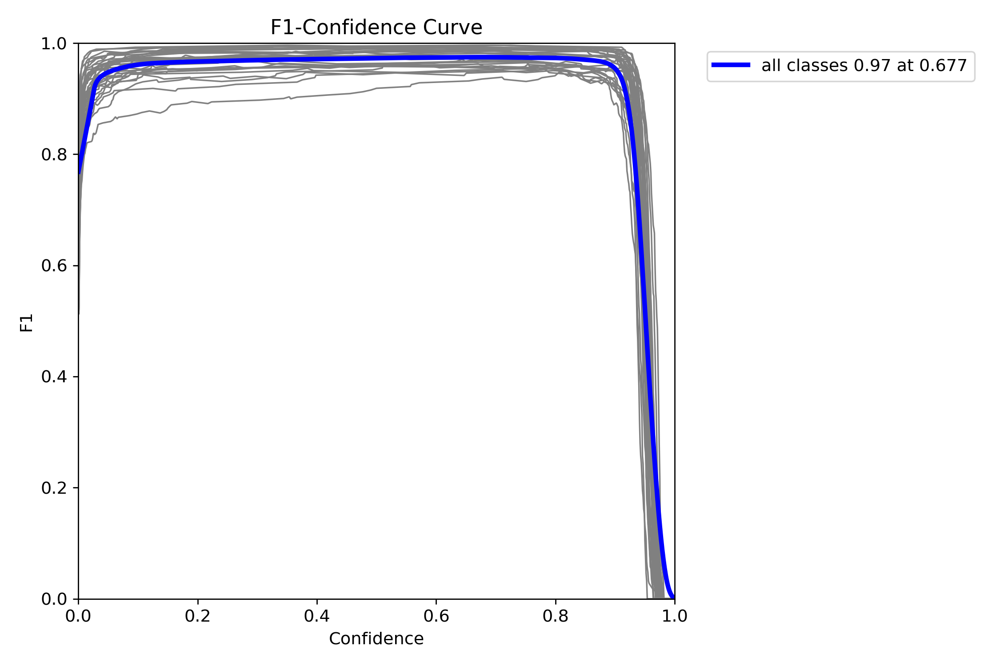
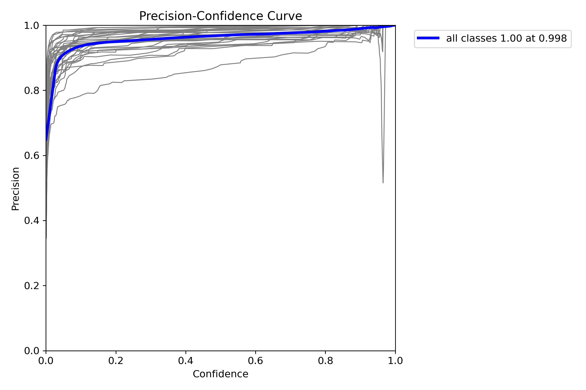
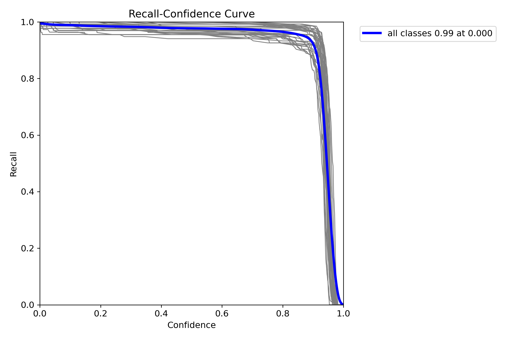
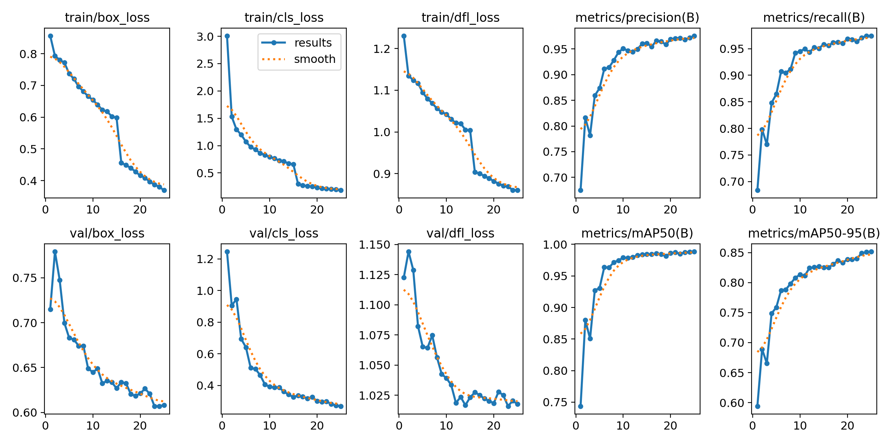

# Arabic Sign Language Real-Time Recognition


## Overview

This project is a real-time detection system for Arabic Sign Language made by YOLOv8

## Table of Contents

1. [Introduction](#introduction)
2. [Features](#features)
3. [Demo](#demo)
4. [Installation](#installation)
5. [Results](#results)

## Introduction

Arabic Sign Language(ASL): A visual-gestural language used by deaf and hard of hearing communities primarily in our Arabian words. Just like spoken languages



- Dataset: [Link Text](https://www.kaggle.com/datasets/ammarsayedtaha/arabic-sign-language-dataset-2022)
- Kaggle Notebook: [Link Text](https://www.kaggle.com/code/abdalrhmantwfik/arabic-sign-language-arsl-yolov10m)


## Features

- The ASL detection system is able to detect the gestures by predicting the boundary box of where the gesture is and what it describes as a label
- Works on Real-Time inference
- Utilizes any webcam to apply the inference

## Demo


## Installation


```bash
pip install ultralytics
pip install opencv-python
pip install matplotlib
pip install numpy
pip install cv2
pip install arabic_reshaper
pip install PIL
```

## Results

- Metrics







- Predictions


